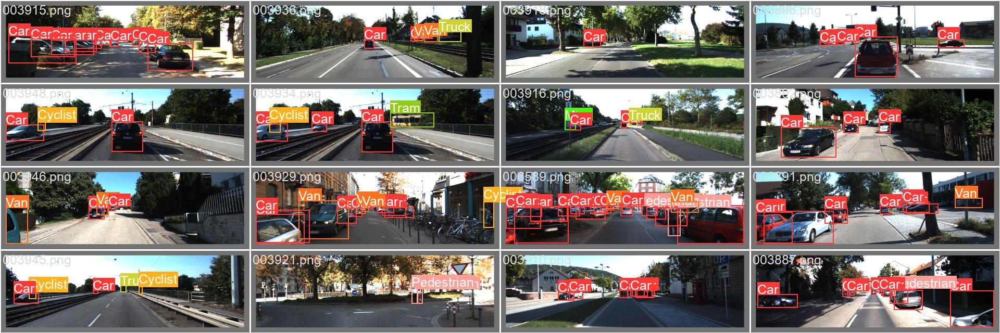
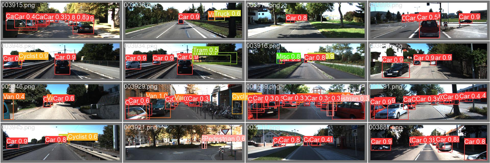
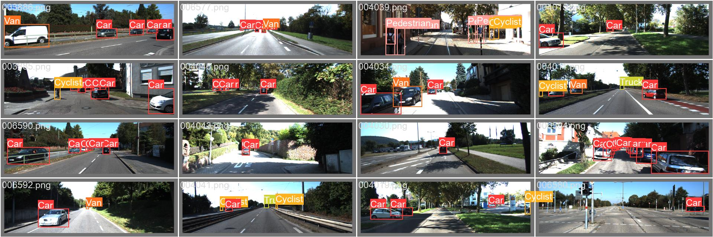
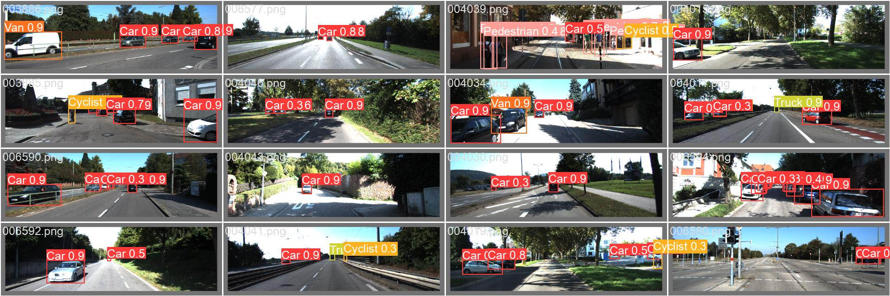
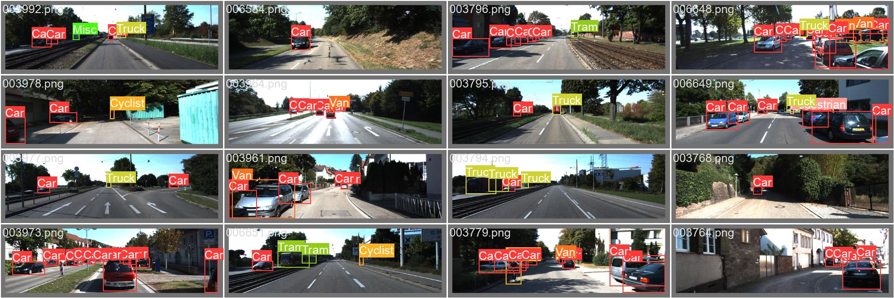
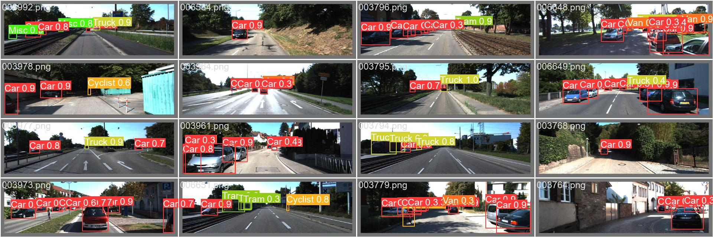
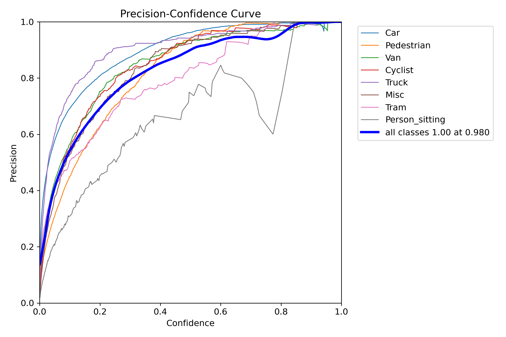
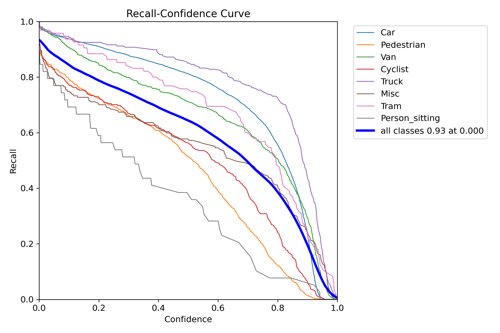
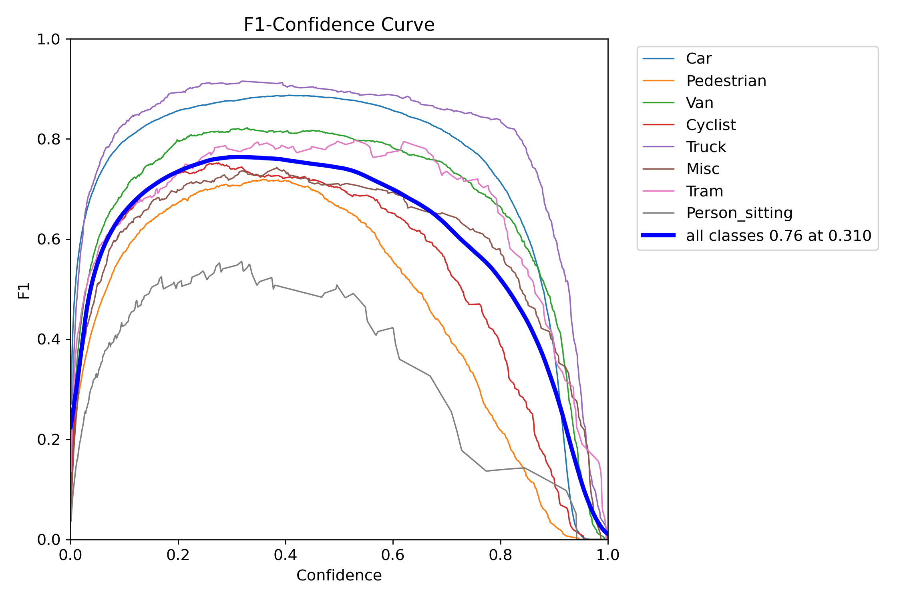
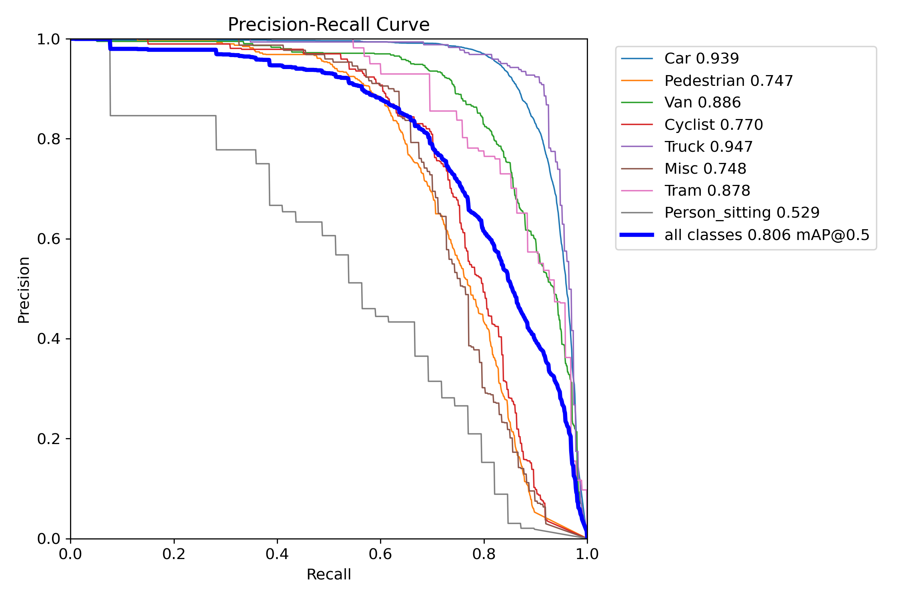

# **Pedestrian Detection Model using TensorFlow**

Object detection is a fundamental task in computer vision that plays a crucial role in various applications, including self-driving cars, robotics, and video surveillance. It involves identifying and localizing objects within images or videos, enabling machines to understand and interact with the visual world.

With the rapid advancements in technology, object detection has become even more vital. Self-driving cars rely on object detection to perceive their surroundings, making critical decisions to navigate safely on the roads. Robotics applications utilize object detection to recognize objects and interact with them intelligently. Video surveillance systems rely on object detection to detect and track suspicious activities in real-time.

To achieve accurate and efficient object detection, convolutional neural networks (CNNs) have emerged as the most effective approach. CNNs, inspired by the biological visual system, can learn to extract meaningful features from images and make predictions about the presence and location of objects. One of the notable deep learning models for object detection is YOLOv8, which leverages the power of CNNs to achieve real-time object detection with high accuracy.

Pedestrian Detection for pedesterians and also other vechicles in a road is a very basic Problem.This Problem is useful in today's Automated Cars and can also be useful in Traffic and Help in Road Safety.

It Able to identify the vechicles and Pedesterians.

### [This Is My Kaggle File](https://www.kaggle.com/code/shadowadi78/kittiobjectdetection/edit/run/171611432)

#### **The Goal is to create a model which can able to Predict Vechicles and Pedesterians.**

## **Features**
* Model Can Able to predict Pedesterians in Images and Videos Also
* I Have Checked My Model Performance On `F1 Score`,`Precision Score` and `Recall Score` and Also Check `Confusion Matrix`.I Have Also Created The Plot For  These Scores To Get a visual representation.
* Precision Score Comes to be around 1.0.
* F1 Score is also than 0.8.
* Recall Also Greater than 0.8.

## **Installation**

I Used `pip`.

I Used Packages Like `Tensorflow`,`Opencv-Python`,`Ultralytics`,`pandas`,`numpy`,`PIL`,`tqdm`,`matplotlib`,`scikit-learn`

## Dataset Description
### [Link For Dataset](https://www.kaggle.com/datasets/klemenko/kitti-dataset)

The Model Can Able to predict Bounding Boxes And Their Classification among below Classes.
There are Total 8 Classes in the Dataset-
> "Car":int0
> "Pedestrian":int1
> "Van":int2
> "Cyclist":int3
> "Truck":int4
> "Misc":int5
> "Tram":int6
> "Person_sitting":int7

## Training And Test
I Have Splitted My Dataset on `Train` and `Test`.
Total Length of  `Train` Set is 5984.
Total Length of `Test` Set is 1497.  

The Set Consist of Two Things One is Inages and other is Their Respective .txt file.

## Model Architecture
### The Model I Use is `YoloV8n`.
* YOLOv8 is a state-of-the-art deep learning model for real-time object detection in computer vision applications.
* Its advanced architecture and algorithms enable accurate and efficient object detection.
* YOLOv8 is widely used in industries such as robotics, autonomous driving, and video surveillance.
* I Use This Model For 20 Epochs And Patience of 3.
* The head of YOLOv8 consists of multiple convolutional layers followed by a series of fully connected layers.

* These layers are responsible for predicting bounding boxes, objectness scores, and class probabilities for the objects detected in an image.

* One of the key features of YOLOv8 is the use of a self-attention mechanism in the head of the network.

* This mechanism allows the model to focus on different parts of the image and adjust the importance of different features based on their relevance to the task.

## **Results**

### For Batch 0 

### For Batch 1

### For Batch 1

### Confusion Matrix

.png)

### Precision Curve

### Recall Curve

### F1 Curve

### Precision And Recall Curve

